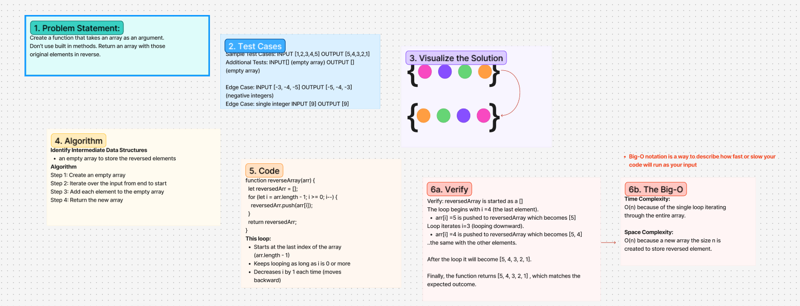

<!-- 401 Whiteboard Process -->

# Challenge Title
reverse-array (cc1)

## Whiteboard Process

[https://www.figma.com/board/tSS5jeJ3B4iA2ivMZeKVD9/Whiteboard-Process?node-id=0-1&t=qpENg3q9JZFHI9md-1]

## Approach & Efficiency
<!-- What approach did you take? Why? What is the Big O space/time for this approach? -->

## Solution
<!-- Show how to run your code, and examples of it in action -->

 - [ ] Top-level README “Table of Contents” is updated
 - [x] README for this challenge is complete
       - [ ] Summary, Description, Approach & Efficiency, Solution
       - [ ] Picture of whiteboard
       - [ ] Link to code
 - [ ] Feature tasks for this challenge are completed
 - [ ] Unit tests written and passing
       - [ ] “Happy Path” - Expected outcome
       - [ ] Expected failure
       - [ ] Edge Case (if applicable/obvious)

<!--------------------------------------------------------------------------------------->

# Challenge Title
<!-- Challenge Name -->

## Whiteboard Process

## Approach & Efficiency
<!-- What approach did you take? Why? What is the Big O space/time for this approach? -->

## Solution
<!-- Show how to run your code, and examples of it in action -->

 - [ ] Top-level README “Table of Contents” is updated
 - [ ] README for this challenge is complete
       - [ ] Summary, Description, Approach & Efficiency, Solution
       - [ ] Picture of whiteboard
       - [ ] Link to code
 - [ ] Feature tasks for this challenge are completed
 - [ ] Unit tests written and passing
       - [ ] “Happy Path” - Expected outcome
       - [ ] Expected failure
       - [ ] Edge Case (if applicable/obvious)

<!--------------------------------------------------------------------------------------->

# Challenge Title
<!-- Challenge Name -->

## Whiteboard Process

## Approach & Efficiency
<!-- What approach did you take? Why? What is the Big O space/time for this approach? -->

## Solution
<!-- Show how to run your code, and examples of it in action -->

 - [ ] Top-level README “Table of Contents” is updated
 - [ ] README for this challenge is complete
       - [ ] Summary, Description, Approach & Efficiency, Solution
       - [ ] Picture of whiteboard
       - [ ] Link to code
 - [ ] Feature tasks for this challenge are completed
 - [ ] Unit tests written and passing
       - [ ] “Happy Path” - Expected outcome
       - [ ] Expected failure
       - [ ] Edge Case (if applicable/obvious)

<!--------------------------------------------------------------------------------------->

# Challenge Title
<!-- Challenge Name -->

## Whiteboard Process

## Approach & Efficiency
<!-- What approach did you take? Why? What is the Big O space/time for this approach? -->

## Solution
<!-- Show how to run your code, and examples of it in action -->

 - [ ] Top-level README “Table of Contents” is updated
 - [ ] README for this challenge is complete
       - [ ] Summary, Description, Approach & Efficiency, Solution
       - [ ] Picture of whiteboard
       - [ ] Link to code
 - [ ] Feature tasks for this challenge are completed
 - [ ] Unit tests written and passing
       - [ ] “Happy Path” - Expected outcome
       - [ ] Expected failure
       - [ ] Edge Case (if applicable/obvious)

<!--------------------------------------------------------------------------------------->

# Challenge Title
<!-- Challenge Name -->

## Whiteboard Process

## Approach & Efficiency
<!-- What approach did you take? Why? What is the Big O space/time for this approach? -->

## Solution
<!-- Show how to run your code, and examples of it in action -->

 - [ ] Top-level README “Table of Contents” is updated
 - [ ] README for this challenge is complete
       - [ ] Summary, Description, Approach & Efficiency, Solution
       - [ ] Picture of whiteboard
       - [ ] Link to code
 - [ ] Feature tasks for this challenge are completed
 - [ ] Unit tests written and passing
       - [ ] “Happy Path” - Expected outcome
       - [ ] Expected failure
       - [ ] Edge Case (if applicable/obvious)

<!--------------------------------------------------------------------------------------->

# Challenge Title
<!-- Challenge Name -->

## Whiteboard Process

## Approach & Efficiency
<!-- What approach did you take? Why? What is the Big O space/time for this approach? -->

## Solution
<!-- Show how to run your code, and examples of it in action -->

 - [ ] Top-level README “Table of Contents” is updated
 - [ ] README for this challenge is complete
       - [ ] Summary, Description, Approach & Efficiency, Solution
       - [ ] Picture of whiteboard
       - [ ] Link to code
 - [ ] Feature tasks for this challenge are completed
 - [ ] Unit tests written and passing
       - [ ] “Happy Path” - Expected outcome
       - [ ] Expected failure
       - [ ] Edge Case (if applicable/obvious)