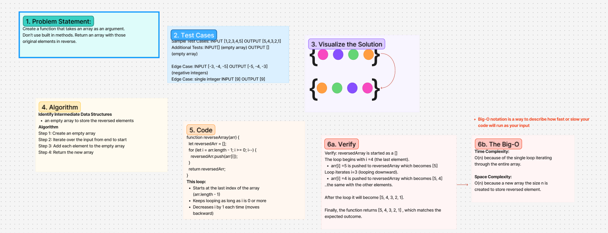

<!-- 401 Whiteboard Process -->

# Challenge Title
reverse-array (cc1)

## Whiteboard Process

[https://www.figma.com/board/tSS5jeJ3B4iA2ivMZeKVD9/Whiteboard-Process?node-id=0-1&t=qpENg3q9JZFHI9md-1]

## Approach & Efficiency
<!-- What approach did you take? Why? What is the Big O space/time for this approach? -->
- We reversed the array by swapping the outside pair inward

**Approach Explanation**
reversedArray is started as a []
The loop begins with i =4 (the last element).
arr[i] =5 is pushed to reversedArray which becomes [5]
Loop iterates i=3 (looping downward).
arr[i] =4 is pushed to reversedArray which becomes [5, 4]
..the same with the other elements.

After the loop it will become [5, 4, 3, 2, 1].

Finally, the function returns [5, 4, 3, 2, 1] , which matches the expected outcome. 

**The Big-O**
*Time Complexity:*
O(n) because of the single loop iterating through the entire array.

*Space Complexity:*
O(n) because a new array the size n is created to store reversed element.

## Solution
<!-- Show how to run your code, and examples of it in action -->
function reverseArray(arr) {
  let reversedArr = [];
  for (let i = arr.length - 1; i >= 0; i--) {
    reversedArr.push(arr[i]);
  }
  return reversedArr;
}
*This loop:*
- Starts at the last index of the array (arr.length - 1)
- Keeps looping as long as i is 0 or more
- Decreases i by 1 each time (moves backward)

<!-- CHECKLIST: Whiteboard Process -->

 - [ ] Top-level README “Table of Contents” is updated
 - [x] README for this challenge is complete
       - [x] Summary, Description, Approach & Efficiency, Solution
       - [x] Picture of whiteboard
       - [ ] Link to code
 - [x] Feature tasks for this challenge are completed
 - [x] Unit tests written and passing
       - [ ] “Happy Path” - Expected outcome
       - [ ] Expected failure
       - [ ] Edge Case (if applicable/obvious)

<!--------------------------------------------------------------------------------------->

# Challenge Title
<!-- Challenge Name -->

## Whiteboard Process

## Approach & Efficiency
<!-- What approach did you take? Why? What is the Big O space/time for this approach? -->
**Approach Explanation**

**The Big-O**
*Time Complexity:*

*Space Complexity:*

## Solution
<!-- Show how to run your code, and examples of it in action -->

<!-- CHECKLIST: Whiteboard Process -->

 - [ ] Top-level README “Table of Contents” is updated
 - [ ] README for this challenge is complete
       - [ ] Summary, Description, Approach & Efficiency, Solution
       - [ ] Picture of whiteboard
       - [ ] Link to code
 - [ ] Feature tasks for this challenge are completed
 - [ ] Unit tests written and passing
       - [ ] “Happy Path” - Expected outcome
       - [ ] Expected failure
       - [ ] Edge Case (if applicable/obvious)

<!--------------------------------------------------------------------------------------->

# Challenge Title
<!-- Challenge Name -->

## Whiteboard Process

## Approach & Efficiency
<!-- What approach did you take? Why? What is the Big O space/time for this approach? -->
**Approach Explanation**

**The Big-O**
*Time Complexity:*

*Space Complexity:*

## Solution
<!-- Show how to run your code, and examples of it in action -->

<!-- CHECKLIST: Whiteboard Process -->

 - [ ] Top-level README “Table of Contents” is updated
 - [ ] README for this challenge is complete
       - [ ] Summary, Description, Approach & Efficiency, Solution
       - [ ] Picture of whiteboard
       - [ ] Link to code
 - [ ] Feature tasks for this challenge are completed
 - [ ] Unit tests written and passing
       - [ ] “Happy Path” - Expected outcome
       - [ ] Expected failure
       - [ ] Edge Case (if applicable/obvious)

<!--------------------------------------------------------------------------------------->

# Challenge Title
<!-- Challenge Name -->

## Whiteboard Process

## Approach & Efficiency
<!-- What approach did you take? Why? What is the Big O space/time for this approach? -->
**Approach Explanation**

**The Big-O**
*Time Complexity:*

*Space Complexity:*

## Solution
<!-- Show how to run your code, and examples of it in action -->

<!-- CHECKLIST: Whiteboard Process -->

 - [ ] Top-level README “Table of Contents” is updated
 - [ ] README for this challenge is complete
       - [ ] Summary, Description, Approach & Efficiency, Solution
       - [ ] Picture of whiteboard
       - [ ] Link to code
 - [ ] Feature tasks for this challenge are completed
 - [ ] Unit tests written and passing
       - [ ] “Happy Path” - Expected outcome
       - [ ] Expected failure
       - [ ] Edge Case (if applicable/obvious)

<!--------------------------------------------------------------------------------------->

# Challenge Title
<!-- Challenge Name -->

## Whiteboard Process

## Approach & Efficiency
<!-- What approach did you take? Why? What is the Big O space/time for this approach? -->
**Approach Explanation**

**The Big-O**
*Time Complexity:*

*Space Complexity:*

## Solution
<!-- Show how to run your code, and examples of it in action -->

<!-- CHECKLIST: Whiteboard Process -->

 - [ ] Top-level README “Table of Contents” is updated
 - [ ] README for this challenge is complete
       - [ ] Summary, Description, Approach & Efficiency, Solution
       - [ ] Picture of whiteboard
       - [ ] Link to code
 - [ ] Feature tasks for this challenge are completed
 - [ ] Unit tests written and passing
       - [ ] “Happy Path” - Expected outcome
       - [ ] Expected failure
       - [ ] Edge Case (if applicable/obvious)

<!--------------------------------------------------------------------------------------->

# Challenge Title
<!-- Challenge Name -->

## Whiteboard Process

## Approach & Efficiency
<!-- What approach did you take? Why? What is the Big O space/time for this approach? -->
**Approach Explanation**

**The Big-O**
*Time Complexity:*

*Space Complexity:*

## Solution
<!-- Show how to run your code, and examples of it in action -->

<!-- CHECKLIST: Whiteboard Process -->

 - [ ] Top-level README “Table of Contents” is updated
 - [ ] README for this challenge is complete
       - [ ] Summary, Description, Approach & Efficiency, Solution
       - [ ] Picture of whiteboard
       - [ ] Link to code
 - [ ] Feature tasks for this challenge are completed
 - [ ] Unit tests written and passing
       - [ ] “Happy Path” - Expected outcome
       - [ ] Expected failure
       - [ ] Edge Case (if applicable/obvious)

<!--------------------------------------------------------------------------------------->

# Challenge Title
<!-- Challenge Name -->

## Whiteboard Process

## Approach & Efficiency
<!-- What approach did you take? Why? What is the Big O space/time for this approach? -->
**Approach Explanation**

**The Big-O**
*Time Complexity:*

*Space Complexity:*

## Solution
<!-- Show how to run your code, and examples of it in action -->

<!-- CHECKLIST: Whiteboard Process -->

 - [ ] Top-level README “Table of Contents” is updated
 - [ ] README for this challenge is complete
       - [ ] Summary, Description, Approach & Efficiency, Solution
       - [ ] Picture of whiteboard
       - [ ] Link to code
 - [ ] Feature tasks for this challenge are completed
 - [ ] Unit tests written and passing
       - [ ] “Happy Path” - Expected outcome
       - [ ] Expected failure
       - [ ] Edge Case (if applicable/obvious)

<!--------------------------------------------------------------------------------------->

# Challenge Title
<!-- Challenge Name -->

## Whiteboard Process

## Approach & Efficiency
<!-- What approach did you take? Why? What is the Big O space/time for this approach? -->
**Approach Explanation**

**The Big-O**
*Time Complexity:*

*Space Complexity:*

## Solution
<!-- Show how to run your code, and examples of it in action -->

<!-- CHECKLIST: Whiteboard Process -->

 - [ ] Top-level README “Table of Contents” is updated
 - [ ] README for this challenge is complete
       - [ ] Summary, Description, Approach & Efficiency, Solution
       - [ ] Picture of whiteboard
       - [ ] Link to code
 - [ ] Feature tasks for this challenge are completed
 - [ ] Unit tests written and passing
       - [ ] “Happy Path” - Expected outcome
       - [ ] Expected failure
       - [ ] Edge Case (if applicable/obvious)

       