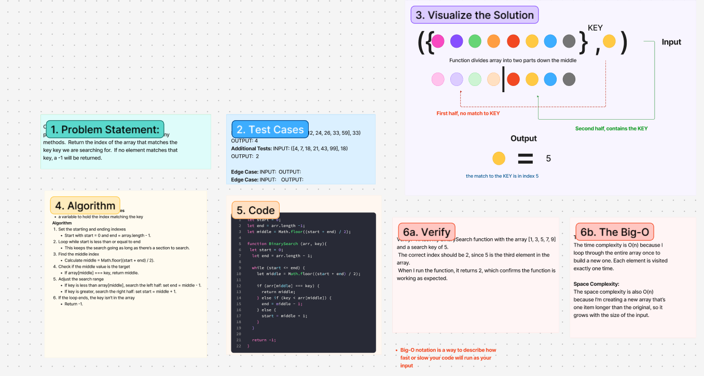

# Challenge Title
array-binary-search

## Whiteboard Process

## Approach & Efficiency
<!-- What approach did you take? Why? What is the Big O space/time for this approach? -->
**Approach Explanation**

**The Big-O**
*Time Complexity:*
The time complexity is O(n) because I loop through the entire array once to build a new one. Each element is visited exactly one time.

*Space Complexity:*
The time complexity is O(n) because I loop through the entire array once to build a new one. Each element is visited exactly one time.

## Solution
<!-- Show how to run your code, and examples of it in action -->
**Code**
let start = 0;
let end = arr.length -1;
let middle = Math.floor((start + end) / 2);

function BinarySearch (arr, key){
 let start = 0;
  let end = arr.length - 1;

  while (start <= end) {
    let middle = Math.floor((start + end) / 2);

    if (arr[middle] === key) {
      return middle;
    } else if (key < arr[middle]) {
      end = middle - 1;
    } else {
      start = middle + 1;
    }
  }

  return -1;
}

**Identify Intermediate Data Structures**
a variable to hold the index matching the key 
**Algorithm**
Set the starting and ending indexes
- Start with start = 0 and end = array.length - 1.
- Loop while start is less than or equal to end
- This keeps the search going as long as there’s a section to search.-  
- Find the middle index
- Calculate middle = Math.floor((start + end) / 2).
Check if the middle value is the target
- If array[middle] === key, return middle.
Adjust the search range
- If key is less than array[middle], search the left half: set end = middle - 1.
- If key is greater, search the right half: set start = middle + 1.
- If the loop ends, the key isn't in the array
- Return -1.

<!-- CHECKLIST: Whiteboard Process -->

 - [ x ] Top-level README “Table of Contents” is updated
 - [ x ] README for this challenge is complete
       - [ x ] Summary, Description, Approach & Efficiency, Solution
       - [ x ] Picture of whiteboard
       - [ x ] Link to code
 - [ x ] Feature tasks for this challenge are completed
 - [ x ] Unit tests written and passing
       - [ x ] “Happy Path” - Expected outcome
       - [ ] Expected failure
       - [ x ] Edge Case (if applicable/obvious)
