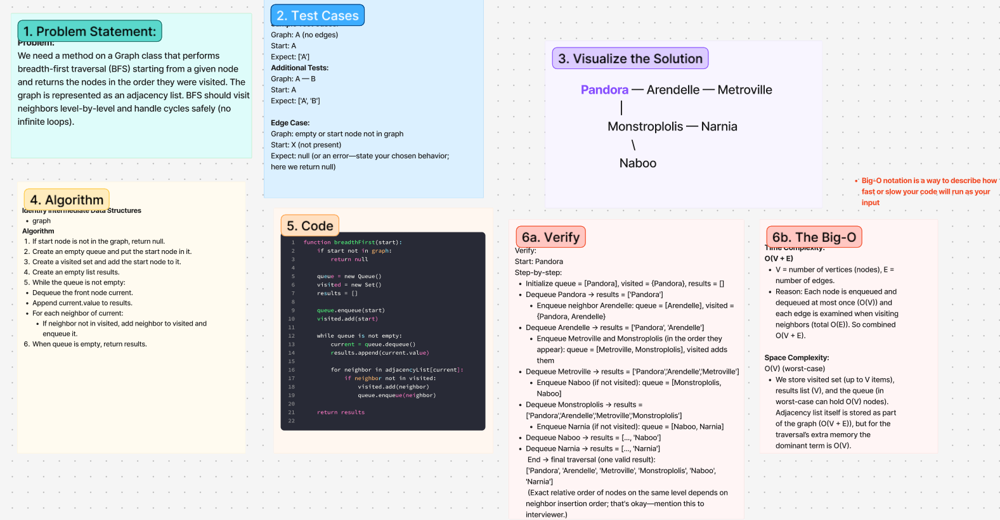

# Challenge Title
<!-- Challenge Name -->
breadth-first-traversal
## Whiteboard Process

## Approach & Efficiency
<!-- What approach did you take? Why? What is the Big O space/time for this approach? -->
**Approach Explanation**
We need a method on a Graph class that performs breadth-first traversal (BFS) starting from a given node and returns the nodes in the order they were visited. The graph is represented as an adjacency list. BFS should visit neighbors level-by-level and handle cycles safely (no infinite loops).

1. If start node is not in the graph, return null.
2. Create an empty queue and put the start node in it.
3. Create a visited set and add the start node to it.
4. Create an empty list results.
5. While the queue is not empty:
    -Dequeue the front node current.
    -Append current.value to results.
    -For each neighbor of current:
        -If neighbor not in visited, add neighbor to visited and enqueue it.
6. When queue is empty, return results.
**The Big-O**
*Time Complexity:*
V = number of vertices (nodes), E = number of edges.
Reason: Each node is enqueued and dequeued at most once (O(V)) and each edge is examined when visiting neighbors (total O(E)). So combined O(V + E).

*Space Complexity:*
O(V) (worst-case)
- We store visited set (up to V items), results list (V), and the queue (in worst-case can hold O(V) nodes). Adjacency list itself is stored as part of the graph (O(V + E)), but for the traversal’s extra memory the dominant term is O(V).
## Solution
<!-- Show how to run your code, and examples of it in action -->

<!-- CHECKLIST: Whiteboard Process -->

 - [ ] Top-level README “Table of Contents” is updated
 - [ ] README for this challenge is complete
       - [ ] Summary, Description, Approach & Efficiency, Solution
       - [ ] Picture of whiteboard
       - [ ] Link to code
 - [ ] Feature tasks for this challenge are completed
 - [ ] Unit tests written and passing
       - [ ] “Happy Path” - Expected outcome
       - [ ] Expected failure
       - [ ] Edge Case (if applicable/obvious)
