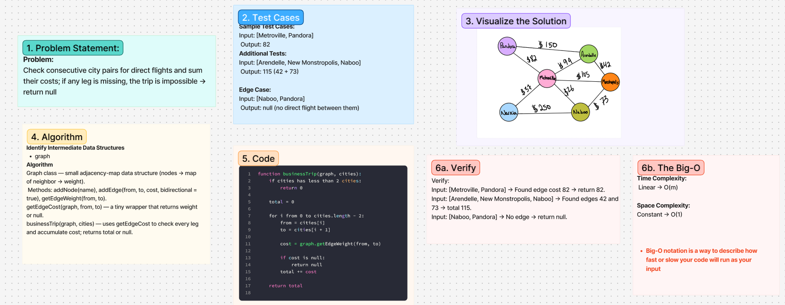

# Challenge Title
<!-- Challenge Name -->
Graph business trip
## Whiteboard Process

## Approach & Efficiency
<!-- What approach did you take? Why? What is the Big O space/time for this approach? -->
**Approach Explanation**
Check consecutive city pairs for direct flights and sum their costs; if any leg is missing, the trip is impossible → return null

Graph class — small adjacency-map data structure (nodes → map of neighbor → weight). Methods: addNode(name), addEdge(from, to, cost, bidirectional = true), getEdgeWeight(from, to).
getEdgeCost(graph, from, to) — a tiny wrapper that returns weight or null.
businessTrip(graph, cities) — uses getEdgeCost to check every leg and accumulate cost; returns total or null.
**The Big-O**
*Time Complexity:*
 Linear → O(m)

*Space Complexity:*
Constant → O(1)
## Solution
<!-- Show how to run your code, and examples of it in action -->
function businessTrip(graph, cities):
    if cities has less than 2 cities:
        return 0
    
    total = 0
    
    for i from 0 to cities.length - 2:
        from = cities[i]
        to = cities[i + 1]
        
        cost = graph.getEdgeWeight(from, to)
        
        if cost is null:
            return null
        total += cost
    
    return total

<!-- CHECKLIST: Whiteboard Process -->

 - [ ] Top-level README “Table of Contents” is updated
 - [ ] README for this challenge is complete
       - [ ] Summary, Description, Approach & Efficiency, Solution
       - [ ] Picture of whiteboard
       - [ ] Link to code
 - [ ] Feature tasks for this challenge are completed
 - [ ] Unit tests written and passing
       - [ ] “Happy Path” - Expected outcome
       - [ ] Expected failure
       - [ ] Edge Case (if applicable/obvious)
