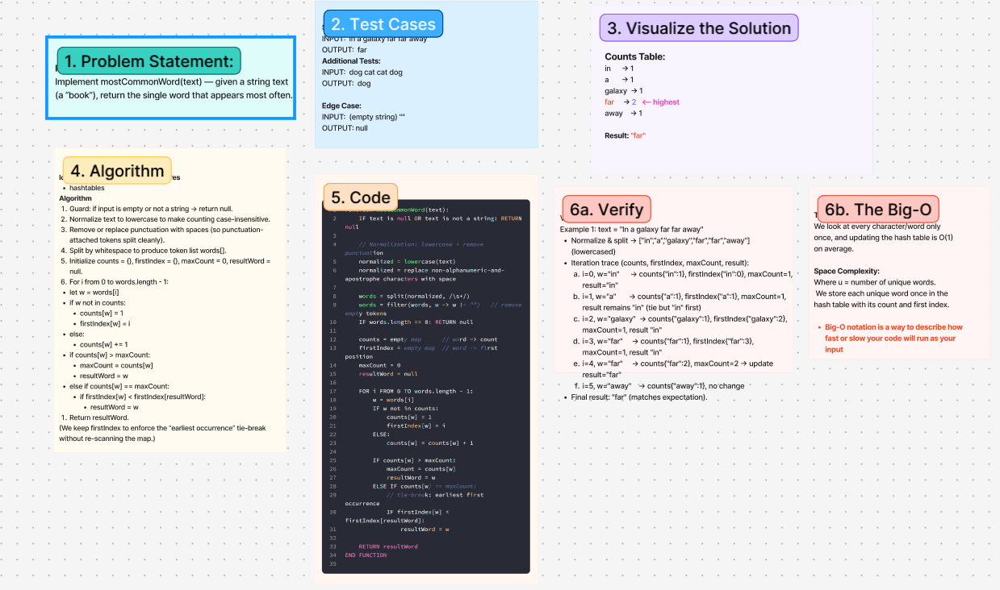

# Challenge Title
<!-- Challenge Name -->
Most Common Words
## Whiteboard Process

## Approach & Efficiency
<!-- What approach did you take? Why? What is the Big O space/time for this approach? -->
**Approach Explanation**
Implement mostCommonWord(text) — given a string text (a “book”), return the single word that appears most often

*Algorithm*
Guard: if input is empty or not a string → return null.
Normalize text to lowercase to make counting case-insensitive.
Remove or replace punctuation with spaces (so punctuation-attached tokens split cleanly).
Split by whitespace to produce token list words[].
Initialize counts = {}, firstIndex = {}, maxCount = 0, resultWord = null.
For i from 0 to words.length - 1:
let w = words[i]
if w not in counts:
counts[w] = 1
firstIndex[w] = i
else:
counts[w] += 1
if counts[w] > maxCount:
maxCount = counts[w]
resultWord = w
else if counts[w] == maxCount:
if firstIndex[w] < firstIndex[resultWord]:
resultWord = w
Return resultWord.
(We keep firstIndex to enforce the “earliest occurrence” tie-break without re-scanning the map.)
**The Big-O**
*Time Complexity:*
We look at every character/word only once, and updating the hash table is O(1) on average.

*Space Complexity:*
Where u = number of unique words. We store each unique word once in the hash table with its count and first index.
## Solution
<!-- Show how to run your code, and examples of it in action -->
 text = "In a galaxy far far away"
Normalize & split → ["in","a","galaxy","far","far","away"] (lowercased)
Iteration trace (counts, firstIndex, maxCount, result):
i=0, w="in"      → counts{"in":1}, firstIndex{"in":0}, maxCount=1, result="in"
i=1, w="a"       → counts{"a":1}, firstIndex{"a":1}, maxCount=1, result remains "in" (tie but "in" first)
i=2, w="galaxy"  → counts{"galaxy":1}, firstIndex{"galaxy":2}, maxCount=1, result "in"
i=3, w="far"     → counts{"far":1}, firstIndex{"far":3}, maxCount=1, result "in"
i=4, w="far"     → counts{"far":2}, maxCount=2 → update result="far"
i=5, w="away"    → counts{"away":1}, no change
Final result: "far" (matches expectation).

<!-- CHECKLIST: Whiteboard Process -->

 - [ x ] Top-level README “Table of Contents” is updated
 - [ x ] README for this challenge is complete
       - [ x ] Summary, Description, Approach & Efficiency, Solution
       - [ x ] Picture of whiteboard
       - [ x ] Link to code
 - [ x ] Feature tasks for this challenge are completed
 - [ ] Unit tests written and passing
       - [ ] “Happy Path” - Expected outcome
       - [ ] Expected failure
       - [ ] Edge Case (if applicable/obvious)
