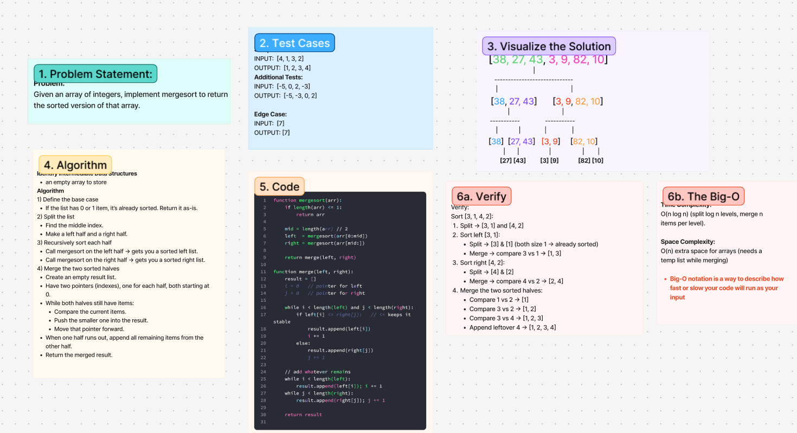

# Challenge Title
<!-- Challenge Name -->
HashTables
## Whiteboard Process

## Approach & Efficiency
<!-- What approach did you take? Why? What is the Big O space/time for this approach? -->
**Approach Explanation**
Given an array of integers, implement mergesort to return the sorted version of that array.
**The Big-O**
*Time Complexity:*
O(n log n) (split log n levels, merge n items per level).

*Space Complexity:*
O(n) extra space for arrays (needs a temp list while merging)
## Solution
<!-- Show how to run your code, and examples of it in action -->
Sort [3, 1, 4, 2]:
Split → [3, 1] and [4, 2]
Sort left [3, 1]:
Split → [3] & [1] (both size 1 → already sorted)
Merge → compare 3 vs 1 → [1, 3]
Sort right [4, 2]:
Split → [4] & [2]
Merge → compare 4 vs 2 → [2, 4]
Merge the two sorted halves:
Compare 1 vs 2 → [1]
Compare 3 vs 2 → [1, 2]
Compare 3 vs 4 → [1, 2, 3]
Append leftover 4 → [1, 2, 3, 4]
<!-- CHECKLIST: Whiteboard Process -->

 - [ x ] Top-level README “Table of Contents” is updated
 - [ x ] README for this challenge is complete
       - [ x ] Summary, Description, Approach & Efficiency, Solution
       - [ x ] Picture of whiteboard
       - [ x ] Link to code
 - [ x ] Feature tasks for this challenge are completed
 - [ x ] Unit tests written and passing
       - [ x ] “Happy Path” - Expected outcome
       - [ x ] Expected failure
       - [ x ] Edge Case (if applicable/obvious)
