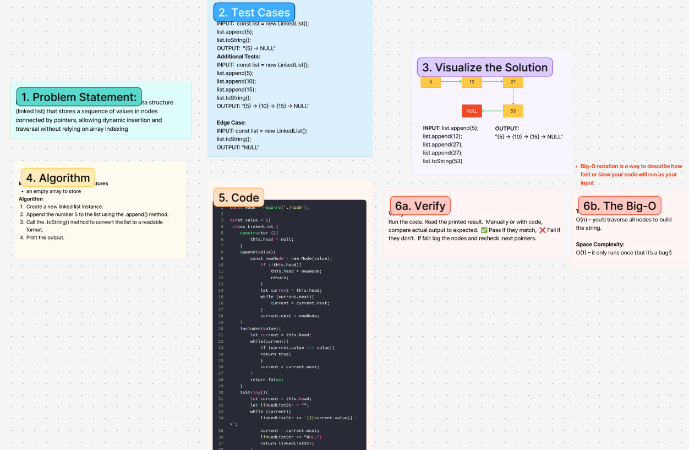

# Challenge Title
**Linked Lists**

## Whiteboard Process

## Approach & Efficiency
<!-- What approach did you take? Why? What is the Big O space/time for this approach? -->
Create and manage a simple linear data structure (linked list) that stores a sequence of values in nodes connected by pointers, allowing dynamic insertion and traversal without relying on array indexing
**Approach Explanation**

**The Big-O**
*Time Complexity:*
O(n) – you’d traverse all nodes to build the string.

*Space Complexity:*
O(1) – it only runs once (but it’s a bug!)

## Solution
<!-- Show how to run your code, and examples of it in action -->
const Node = require('./node');

const value = 5;
 class LinkedList {
    constructor (){
        this.head = null; 
    }
    append(value){ 
        const newNode = new Node(value);
            if (!this.head){ 
                this.head = newNode; 
                return;
            }
            let current = this.head;
            while (current.next){ 
                current = current.next;
            }
            current.next = newNode; 
    }
    includes(value){
        let current = this.head; 
        while(current){ 
            if (current.value === value){ 
            return true;
            }
            current = current.next; 
        }
        return false; 
    }
    toString(){ 
        let current = this.head; 
        let linkedListStr = "";
        while (current){
            linkedListStr += `{${current.value}} ->`;
            current = current.next; 
            linkedListStr += "NULL"; 
            return linkedListStr;
        }
    }
 }

<!-- CHECKLIST: Whiteboard Process -->

 - [ x ] Top-level README “Table of Contents” is updated
 - [ x ] README for this challenge is complete
       - [ x ] Summary, Description, Approach & Efficiency, Solution
       - [ x ] Picture of whiteboard
       - [ x ] Link to code
 - [ x ] Feature tasks for this challenge are completed
 - [  ] Unit tests written and passing
       - [ ] “Happy Path” - Expected outcome
       - [ ] Expected failure
       - [ ] Edge Case (if applicable/obvious)

<!--------------------------------------------------------------------------------------->

# Challenge Title
<!-- Challenge Name -->

## Whiteboard Process

## Approach & Efficiency
<!-- What approach did you take? Why? What is the Big O space/time for this approach? -->
**Approach Explanation**

**The Big-O**
*Time Complexity:*

*Space Complexity:*

## Solution
<!-- Show how to run your code, and examples of it in action -->

<!-- CHECKLIST: Whiteboard Process -->

 - [ ] Top-level README “Table of Contents” is updated
 - [ ] README for this challenge is complete
       - [ ] Summary, Description, Approach & Efficiency, Solution
       - [ ] Picture of whiteboard
       - [ ] Link to code
 - [ ] Feature tasks for this challenge are completed
 - [ ] Unit tests written and passing
       - [ ] “Happy Path” - Expected outcome
       - [ ] Expected failure
       - [ ] Edge Case (if applicable/obvious)
