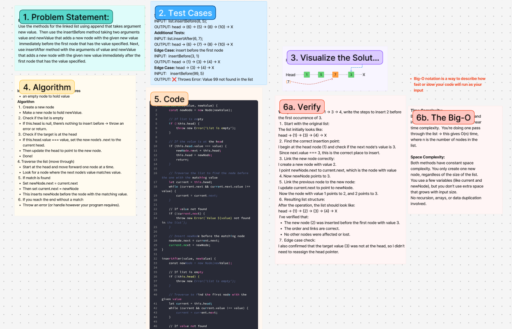

# Challenge Title
Insert Linked Lists

## Whiteboard Process

## Approach & Efficiency
<!-- What approach did you take? Why? What is the Big O space/time for this approach? -->
Use the methods for the linked list using append that takes argument
new value. Then use the insertBefore method taking two arguments
value and newValue that adds a new node with the given new value
 immediately before the first node that has the value specified. Next, 
use insertAfter method with the arguments of value and newValue
that adds a new node with the given new value immediately after the 
first node that has the value specified.
**Approach Explanation**
1. Create a new node
2. Make a new node to hold newValue.
3. Check if the list is empty
    If this.head is null, there’s nothing to insert before → throw an error or return.
4. Check if the target is at the head
    If this.head.value === value, set the new node’s .next to the current head.
5. Then update the head to point to the new node.
6. Traverse the list (move through)
    1. Start at the head and move forward one node at a time.
    2. Look for a node where the next node’s value matches value.
        If match is found
    3. Set newNode.next = current.next
    4.Then set current.next = newNode
    5. This inserts newNode before the node with the matching value.
    6. If you reach the end without a match
        Throw an error (or handle however your program requires).

**The Big-O**
*Time Complexity:*
Both insertBefore(value, newValue) and insertAfter(value, newValue) have linear time complexity.  You’re doing one pass through the list → this gives O(n) time, where n is the number of nodes in the list.

*Space Complexity:*
Both methods have constant space complexity. You only create one new node, regardless of the size of the list.
You use a few variables (like current and newNode), but you don’t use extra space that grows with input size.
No recursion, arrays, or data duplication involved.

## Solution
<!-- Show how to run your code, and examples of it in action -->
`insertBefore`(value, newValue) {
    const newNode = new Node(newValue);

    // If list is empty
    if (!this.head) {
        throw new Error('List is empty');
    }

    // If the value is at the head
    if (this.head.value === value) {
        newNode.next = this.head;
        this.head = newNode;
        return;
    }

    // Traverse the list to find the node before the one with the matching value
    let current = this.head;
    while (current.next && current.next.value !== value) {
        current = current.next;
    }

    // If value not found
    if (!current.next) {
        throw new Error(`Value ${value} not found in the list`);
    }

    // Insert newNode before the matching node
    newNode.next = current.next;
    current.next = newNode;
}

`insertAfter`(value, newValue) {
    const newNode = new Node(newValue);

    // If list is empty
    if (!this.head) {
        throw new Error('List is empty');
    }

    // Traverse to find the first node with the given value
    let current = this.head;
    while (current && current.value !== value) {
        current = current.next;
    }

    // If value not found
    if (!current) {
        throw new Error(`Value ${value} not found in the list`);
    }

    // Insert newNode after the matching node
    newNode.next = current.next;
    current.next = newNode;
}
<!-- CHECKLIST: Whiteboard Process -->

 - [ x ] Top-level README “Table of Contents” is updated
 - [ x ] README for this challenge is complete
       - [ x ] Summary, Description, Approach & Efficiency, Solution
       - [ x ] Picture of whiteboard
       - [ x ] Link to code
 - [ x ] Feature tasks for this challenge are completed
 - [ x ] Unit tests written and passing
       - [ ] “Happy Path” - Expected outcome
       - [ ] Expected failure
       - [ ] Edge Case (if applicable/obvious)

<!--------------------------------------------------------------------------------------->

# Challenge Title
<!-- Challenge Name -->

## Whiteboard Process

## Approach & Efficiency
<!-- What approach did you take? Why? What is the Big O space/time for this approach? -->
**Approach Explanation**

**The Big-O**
*Time Complexity:*

*Space Complexity:*

## Solution
<!-- Show how to run your code, and examples of it in action -->

<!-- CHECKLIST: Whiteboard Process -->

 - [ ] Top-level README “Table of Contents” is updated
 - [ ] README for this challenge is complete
       - [ ] Summary, Description, Approach & Efficiency, Solution
       - [ ] Picture of whiteboard
       - [ ] Link to code
 - [ ] Feature tasks for this challenge are completed
 - [ ] Unit tests written and passing
       - [ ] “Happy Path” - Expected outcome
       - [ ] Expected failure
       - [ ] Edge Case (if applicable/obvious)