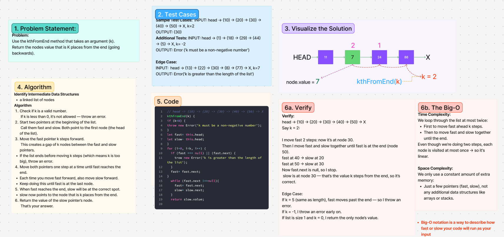

# Challenge Title
<!-- Challenge Name -->
kthFromEnd(k)
## Whiteboard Process

## Approach & Efficiency
<!-- What approach did you take? Why? What is the Big O space/time for this approach? -->
**Approach Explanation**

**The Big-O**
*Time Complexity:*

*Space Complexity:*

## Solution
<!-- Show how to run your code, and examples of it in action -->
1. Check if k is a valid number. If k is less than 0, it's not allowed — throw an error.
2. Start two pointers at the beginning of the list. Call them fast and slow. Both point to the first node (the head of the list).
3. Move the fast pointer k steps forward. This creates a gap of k nodes between the fast and slow pointers.
    If the list ends before moving k steps (which means k is too big), throw an error.
4. Move both pointers one step at a time until fast reaches the end.
    Each time you move fast forward, also move slow forward.
    Keep doing this until fast is at the last node.
5. When fast reaches the end, slow will be at the correct spot.
    slow now points to the node that is k places from the end.
6. Return the value of the slow pointer’s node. That’s your answer.

**The Big-O**
*Time Complexity:*
We loop through the list at most twice:
    First to move fast ahead k steps.
    Then to move fast and slow together until the end.
*Even though we’re doing two steps, each node is visited at most once → so it's linear.*

*Space Complexity:*
We only use a constant amount of extra memory:
    Just a few pointers (fast, slow), not any additional data structures like arrays or stacks. 
## Solution
<!-- Show how to run your code, and examples of it in action -->
**// head -> {10} -> {20} -> {30} -> {40} -> {50} -> X**
kthFromEnd(k) {
if (k<0) {
throw new Error('k must be a non-negative number');
}
let fast= this.head;
let slow- this.head;
}
for (i=0, i<k, i++) {
  if (fast === null) || (fast.next) {
    trow new Error('k is greater than the length of the list');
  }
  fast= fast.next;
}
  while (fast.next !==null){
    fast= fast.next;
    slow= slow.next;
  }
  return slow.value;

<!-- CHECKLIST: Whiteboard Process -->

 - [ x ] Top-level README “Table of Contents” is updated
 - [ x ] README for this challenge is complete
       - [ x ] Summary, Description, Approach & Efficiency, Solution
       - [ x ] Picture of whiteboard
       - [ x ] Link to code
 - [ x ] Feature tasks for this challenge are completed
 - [ x ] Unit tests written and passing
       - [ x ] “Happy Path” - Expected outcome
       - [ x ] Expected failure
       - [ x ] Edge Case (if applicable/obvious)

