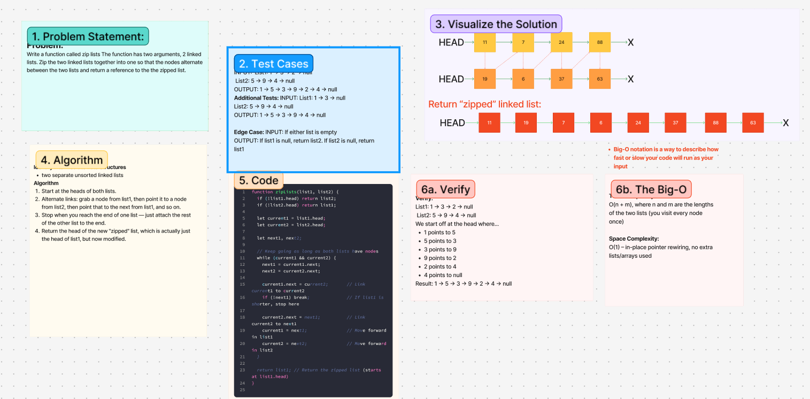

# Challenge Title
<!-- Challenge Name -->
Linked-list-zip
## Whiteboard Process

## Approach & Efficiency
<!-- What approach did you take? Why? What is the Big O space/time for this approach? -->
**Approach Explanation**
Write a function called zip lists The function has two arguments, 2 linked lists. Zip the two linked lists together into one so that the nodes alternate between the two lists and return a reference to the the zipped list.

**The Big-O**
*Time Complexity:*
O(n + m), where n and m are the lengths of the two lists (you visit every node once)

*Space Complexity:*
O(1) – in-place pointer rewiring, no extra lists/arrays used  

## Solution
<!-- Show how to run your code, and examples of it in action -->
function zipLists(list1, list2) {
  if (!list1.head) return list2;
  if (!list2.head) return list1;

  let current1 = list1.head;
  let current2 = list2.head;

  let next1, next2;

  while (current1 && current2) {
    next1 = current1.next;
    next2 = current2.next;

    current1.next = current2;       // Link current1 to current2
    if (!next1) break;              // If list1 is shorter, stop here

    current2.next = next1;          // Link current2 to next1
    current1 = next1;               // Move forward in list1
    current2 = next2;               // Move forward in list2
  }

  return list1; 
}

<!-- CHECKLIST: Whiteboard Process -->

 - [ x ] Top-level README “Table of Contents” is updated
 - [ x ] README for this challenge is complete
       - [ x ] Summary, Description, Approach & Efficiency, Solution
       - [ x ] Picture of whiteboard
       - [ x ] Link to code
 - [ x ] Feature tasks for this challenge are completed
 - [ x ] Unit tests written and passing
       - [ x ] “Happy Path” - Expected outcome
       - [ ] Expected failure
       - [ x ] Edge Case (if applicable/obvious)