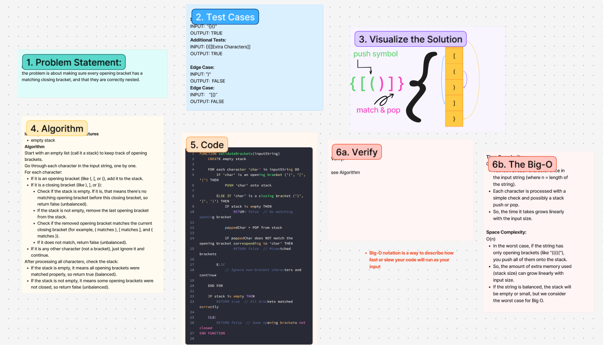

# Challenge Title
<!-- Challenge Name -->
Stack-Queue-Brackets
## Whiteboard Process

## Approach & Efficiency
<!-- What approach did you take? Why? What is the Big O space/time for this approach? -->
**Approach Explanation**
*Identify Intermediate Data Structures*
empty stack
*Algorithm*
Start with an empty list (call it a stack) to keep track of opening brackets.
Go through each character in the input string, one by one.
For each character:
If it is an opening bracket (like (, [, or {), add it to the stack.
If it is a closing bracket (like ), ], or }):
Check if the stack is empty. If it is, that means there's no matching opening bracket before this closing bracket, so return false (unbalanced).
If the stack is not empty, remove the last opening bracket from the stack.
Check if the removed opening bracket matches the current closing bracket (for example, ( matches ), [ matches ], and { matches }).
If it does not match, return false (unbalanced).
If it is any other character (not a bracket), just ignore it and continue.
After processing all characters, check the stack:
If the stack is empty, it means all opening brackets were matched properly, so return true (balanced).
If the stack is not empty, it means some opening brackets were not closed, so return false (unbalanced).

**The Big-O**
*Time Complexity:*
**O(n)**
You look at each character once in the input string (where n = length of the string).
Each character is processed with a simple check and possibly a stack push or pop.
So, the time it takes grows linearly with the input size.

*Space Complexity:*
**O(n)**
In the worst case, if the string has only opening brackets (like "((((("), you push all of them onto the stack.
So, the amount of extra memory used (stack size) can grow linearly with input size.
If the string is balanced, the stack will be empty or small, but we consider the worst case for Big O.

## Solution
<!-- Show how to run your code, and examples of it in action -->
FUNCTION validateBrackets(inputString)
    CREATE empty stack
    
    FOR each character 'char' in inputString DO
        IF 'char' is an opening bracket ('(', '[', '{') THEN
            PUSH 'char' onto stack
            
        ELSE IF 'char' is a closing bracket (')', ']', '}') THEN
            IF stack is empty THEN
                RETURN false  // No matching opening bracket
                
            poppedChar = POP from stack
            
            IF poppedChar does NOT match the opening bracket corresponding to 'char' THEN
                RETURN false  // Mismatched brackets
                
        ELSE
            // Ignore non-bracket characters and continue
            
    END FOR
    
    IF stack is empty THEN
        RETURN true  // All brackets matched correctly
        
    ELSE
        RETURN false  // Some opening brackets not closed
END FUNCTION

<!-- CHECKLIST: Whiteboard Process -->

 - [ x ] Top-level README “Table of Contents” is updated
 - [ x ] README for this challenge is complete
       - [ x ] Summary, Description, Approach & Efficiency, Solution
       - [ x ] Picture of whiteboard
       - [ x ] Link to code
 - [ x ] Feature tasks for this challenge are completed
 - [ x ] Unit tests written and passing
       - [ x ] “Happy Path” - Expected outcome
       - [ x ] Expected failure
       - [ x ] Edge Case (if applicable/obvious)
