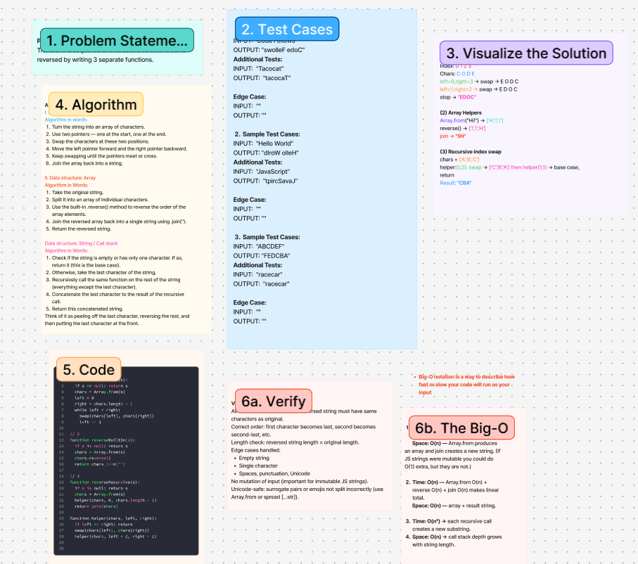

# Challenge Title
<!-- Challenge Name -->

## Whiteboard Process

## Approach & Efficiency
<!-- What approach did you take? Why? What is the Big O space/time for this approach? -->
**Approach Explanation**
Transform a sequence of characters so their order is reversed by writing 3 separate functions.

*Data structure:* String / Call stack
*Algorithm:*
Check if the string is empty or has only one character. If so, return it (this is the base case).
Otherwise, take the last character of the string.
Recursively call the same function on the rest of the string (everything except the last character).
Concatenate the last character to the result of the recursive call.
Return this concatenated string.
Think of it as peeling off the last character, reversing the rest, and then putting the last character at the front.

**The Big-O**
1. Time: O(n) — one pass swapping pairs.
       Space: O(n) — Array.from produces an array and join creates a new string. (If JS strings were mutable you could do O(1) extra, but they are not.)

2. Time: O(n) — Array.from O(n) + reverse O(n) + join O(n) makes linear total.
      Space: O(n) — array + result string.

3. Time: O(n²) → each recursive call creates a new substring.
      Space: O(n) → call stack depth grows with string length.

## Solution
<!-- Show how to run your code, and examples of it in action -->
// 1
function reverseSwap(s):
  if s == null: return s
  chars = Array.from(s)
  left = 0
  right = chars.length - 1
  while left < right:
    swap(chars[left], chars[right])
    left += 1

// 2
function reverseBuiltIn(s):
  if s is null: return s
  chars = Array.from(s)
  chars.reverse()
  return chars.join('')

// 3
function reverseRecursive(s):
  if s is null: return s
  chars = Array.from(s)
  helper(chars, 0, chars.length - 1)
  return join(chars)

function helper(chars, left, right):
  if left >= right: return
  swap(chars[left], chars[right])
  helper(chars, left + 1, right - 1)

<!-- CHECKLIST: Whiteboard Process -->

 - [ ] Top-level README “Table of Contents” is updated
 - [ ] README for this challenge is complete
       - [ ] Summary, Description, Approach & Efficiency, Solution
       - [ ] Picture of whiteboard
       - [ ] Link to code
 - [ ] Feature tasks for this challenge are completed
 - [ ] Unit tests written and passing
       - [ ] “Happy Path” - Expected outcome
       - [ ] Expected failure
       - [ ] Edge Case (if applicable/obvious)
