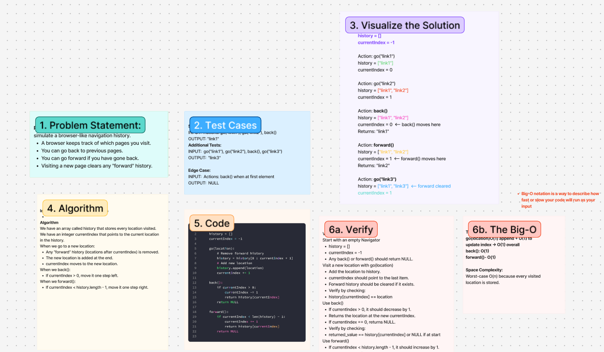

# Challenge Title
<!-- Challenge Name -->
Navigator(history)
## Whiteboard Process

## Approach & Efficiency
<!-- What approach did you take? Why? What is the Big O space/time for this approach? -->
**Approach Explanation**
Simulate a browser-like navigation history.
A browser keeps track of which pages you visit.
You can go back to previous pages.
You can go forward if you have gone back.
Visiting a new page clears any "forward" history.

We have an array called history that stores every location visited.
We have an integer `currentIndex` that points to the current location in the history.
When we go to a new location:
Any “forward” history (locations after currentIndex) is removed.
The new location is added at the end.
currentIndex moves to the new location.
When we `back()`:
If currentIndex > 0, move it one step left.
When we `forward()`:
If `currentIndex` < `history.length` - 1, *move it one step right*.
**The Big-O**
*Time Complexity:*
go(location)O(1) append + O(1) to update index → O(1) overall
back(): O(1)
forward()- O(1)

*Space Complexity:*
Worst-case O(n) because every visited location is stored.
## Solution
<!-- Show how to run your code, and examples of it in action -->
class Navigator:
    history = []
    currentIndex = -1

    go(location):
        # Remove forward history
        history = history[0 : currentIndex + 1]
        # Add new location
        history.append(location)
        currentIndex += 1

    back():
        if currentIndex > 0:
            currentIndex -= 1
            return history[currentIndex]
        return NULL

    forward():
        if currentIndex < len(history) - 1:
            currentIndex += 1
            return history[currentIndex]
        return NULL

<!-- CHECKLIST: Whiteboard Process -->

 - [ ] Top-level README “Table of Contents” is updated
 - [ ] README for this challenge is complete
       - [ ] Summary, Description, Approach & Efficiency, Solution
       - [ ] Picture of whiteboard
       - [ ] Link to code
 - [ ] Feature tasks for this challenge are completed
 - [ ] Unit tests written and passing
       - [ ] “Happy Path” - Expected outcome
       - [ ] Expected failure
       - [ ] Edge Case (if applicable/obvious)
