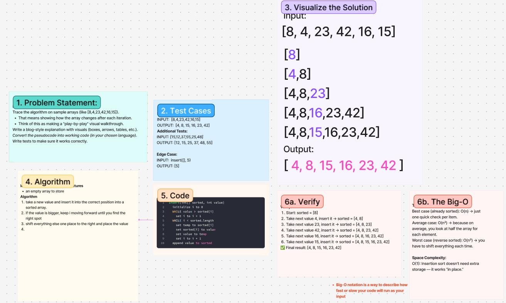

# Challenge Title
<!-- Challenge Name -->
Pseudocode Explanation
## Whiteboard Process

## Approach & Efficiency
<!-- What approach did you take? Why? What is the Big O space/time for this approach? -->
**Approach Explanation**
insert()
- take a new value and insert it into the correct position into a sorted array.
- if the value is bigger, keep i moving forward until you find the right spot
- shift everything else one place to the right and place the value
**The Big-O**
*Time Complexity:*
Best case (already sorted): O(n) → just one quick check per item.
Average case: O(n²) → because on average, you look at half the array for each element.
Worst case (reverse sorted): O(n²) → you have to shift everything each time.

*Space Complexity:*
O(1): Insertion sort doesn’t need extra storage — it works “in place.

## Solution
<!-- Show how to run your code, and examples of it in action -->
Insert(int[] sorted, int value)
  initialize i to 0
  WHILE value > sorted[i]
    set i to i + 1
  WHILE i < sorted.length
    set temp to sorted[i]
    set sorted[i] to value
    set value to temp
    set i to i + 1
  append value to sorted
  **Explained:**
- take a new value and insert it into the correct position into a sorted array.
- if the value is bigger, keep i moving forward until you find the right spot
- shift everything else one place to the right and place the value
<!-- CHECKLIST: Whiteboard Process -->

 - [ x ] Top-level README “Table of Contents” is updated
 - [ x ] README for this challenge is complete
       - [ x ] Summary, Description, Approach & Efficiency, Solution
       - [ x ] Picture of whiteboard
       - [ ] Link to code
 - [ x ] Feature tasks for this challenge are completed
 - [ ] Unit tests written and passing
       - [ x ] “Happy Path” - Expected outcome
       - [ x ] Expected failure
       - [ x ] Edge Case (if applicable/obvious)
